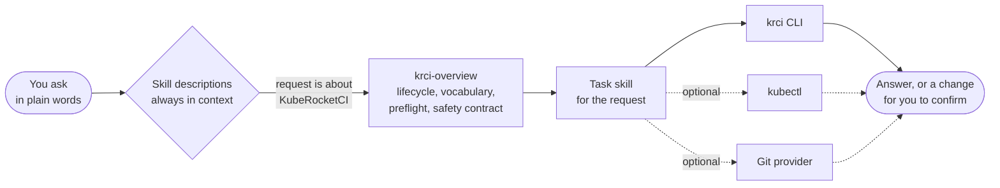

# KubeRocketCI Skills

[](.github/workflows/validate.yml)
[](https://agentskills.io)
[](LICENSE)

Skills that teach your coding agent to deliver software on [KubeRocketCI](https://kuberocketci.io), from the ticket to production: trace a story to the version that runs in each environment, find out why a build failed, check a quality gate, wire a custom pipeline or a deployment template, and decide whether a broken environment is yours to fix. They serve business analysts, product owners and managers, developers, QA engineers, and DevOps engineers. They follow the open [Agent Skills](https://agentskills.io) standard and work in Claude Code, Codex, GitHub Copilot, Cursor, Gemini CLI, and other compatible agents.

> Looking for role craft (writing stories, test plans) or for developing the platform itself? Use [KubeRocketCI/claude-plugins](https://github.com/KubeRocketCI/claude-plugins). See [where the two repositories meet](docs/architecture.md#boundary-with-claude-plugins).

## Install

The commands are the same on Windows, macOS, and Linux.

**1. Add the skills to your agent**

| Agent | Commands |
|---|---|
| Claude Code | `claude plugin marketplace add KubeRocketCI/skills`<br/>`claude plugin install krci@kuberocketci-skills` |
| Codex | `codex plugin marketplace add KubeRocketCI/skills`<br/>`codex plugin add krci@kuberocketci-skills` |
| GitHub Copilot CLI | `copilot plugin marketplace add KubeRocketCI/skills`<br/>`copilot plugin install krci@kuberocketci-skills` |
| Cursor, Gemini CLI, and any other agent | `npx skills add KubeRocketCI/skills` |

`krci` installs every skill, so the agent can follow a change from the ticket to production without you picking skills. Every installed skill adds its short description to each session: `claude plugin details krci@kuberocketci-skills` shows the cost.

**2. Sign in to the platform**

The skills read the platform through the [krci CLI](https://docs.kuberocketci.io/docs/operator-guide/advanced-installation/krci-cli). Install it with `brew tap KubeRocketCI/homebrew-tap && brew install krci`, or take the binary for your system from the [releases](https://github.com/KubeRocketCI/cli/releases), then sign in once:

```bash
krci auth login --portal-url https://<your-portal>
```

`kubectl` with your platform role is optional. It adds pod logs, events, and resource status messages.

## Use

Just ask. There is no command to type and no agent to pick: the agent reads the short description of every skill, notices that your request is about KubeRocketCI, and loads the matching skill by itself.

```text
Which version of orders contains story SHOP-142, and is it in prod yet?
Why did the last pipeline run of my-project fail?
Did the autotest quality gate pass in qa of my-deployment?
Environment qa of my-deployment is unhealthy. Is that mine to fix?
```

## How it works



Only the descriptions stay in the agent's context. A skill body loads when a request matches it, and its reference files load only when that skill needs them.

## Good to know

- **It acts as you.** Every call uses your session and your permissions. When access is denied, the agent reports which role has it and stops.
- **It reads by default.** Before anything that changes state outside your working tree, such as starting a build, pushing, or updating a ticket, it shows the exact action and the target, and waits for your confirmation. Urgency does not count as confirmation.
- **It never prints secret values.** It checks that a secret exists and which keys it has.
- **The krci CLI comes first.** It reads the run history from Tekton Results, as the portal does, and it sees environments on remote clusters. kubectl fills the gaps.
- **Every diagnosis starts with an owner**: application team, platform team, or an external system, then the evidence and what to hand over when the fix is not yours.
- **The login is yours to do.** `krci auth login` opens a browser, an agent cannot complete it. Headless setups use environment variables, see the tooling reference of `krci-overview`.

## Skills

Grouped by delivery stage. [docs/skill-map.md](docs/skill-map.md) shows the planned skills per role.

| Stage | Skill | Roles | Access | What it is for |
|---|---|---|---|---|
| all | [`krci-overview`](plugins/krci/skills/krci-overview/SKILL.md) | all | read-only | Foundation and router for every other skill: delivery lifecycle, roles, platform vocabulary, which tool answers which question, session preflight, the safety contract, the ownership verdict. |
| operate | [`krci-debug-environment`](plugins/krci/skills/krci-debug-environment/SKILL.md) | dev, qa, devops | read-only | Why an environment is unhealthy or out of sync, and who owns the fix. |

## Update

| Agent | Command |
|---|---|
| Claude Code | `claude plugin update krci@kuberocketci-skills` |
| Codex | `codex plugin marketplace upgrade` |
| GitHub Copilot CLI | `copilot plugin update krci` |
| Installed with `npx skills` | `npx skills update` |

## Contributing

How the repository is built is in [docs/architecture.md](docs/architecture.md). How to add a skill is in [CONTRIBUTING.md](CONTRIBUTING.md). Security reports go through [SECURITY.md](SECURITY.md).

## License

[Apache-2.0](LICENSE)
