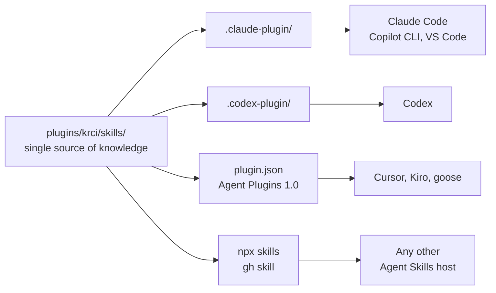
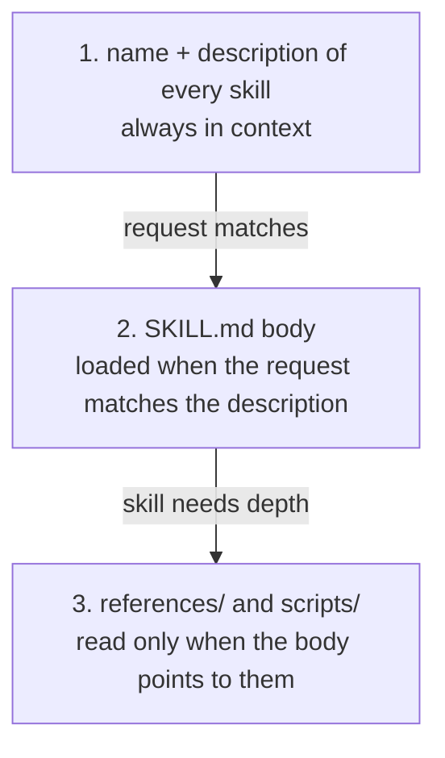
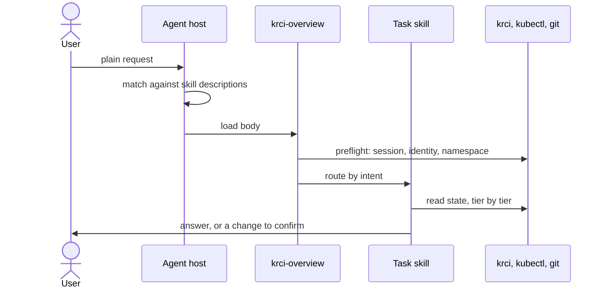
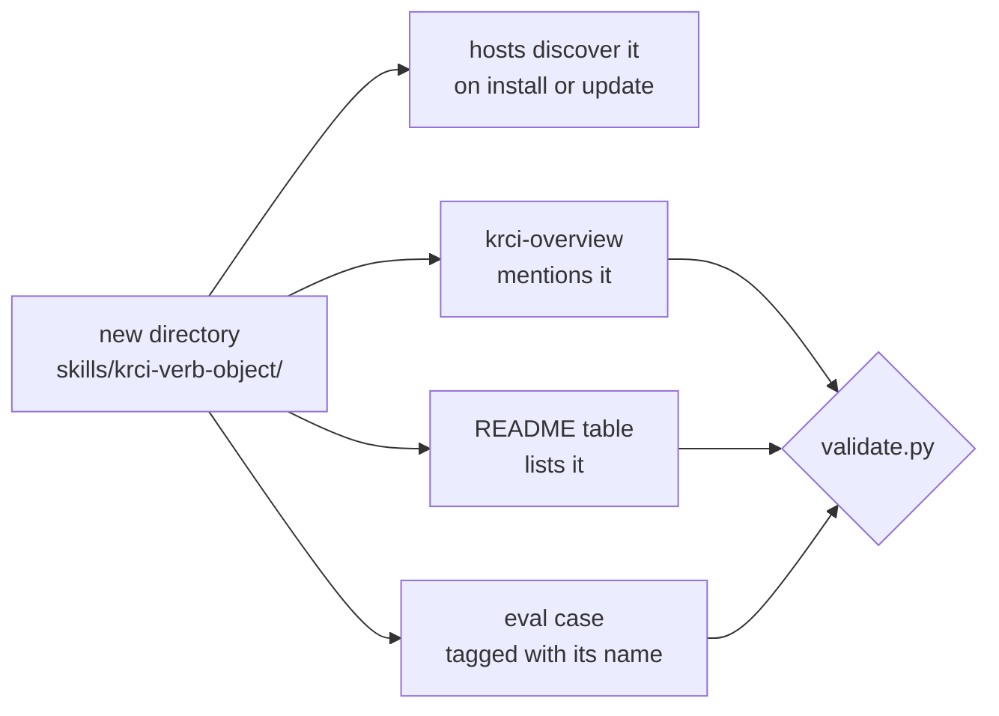
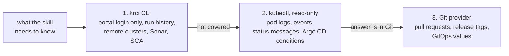
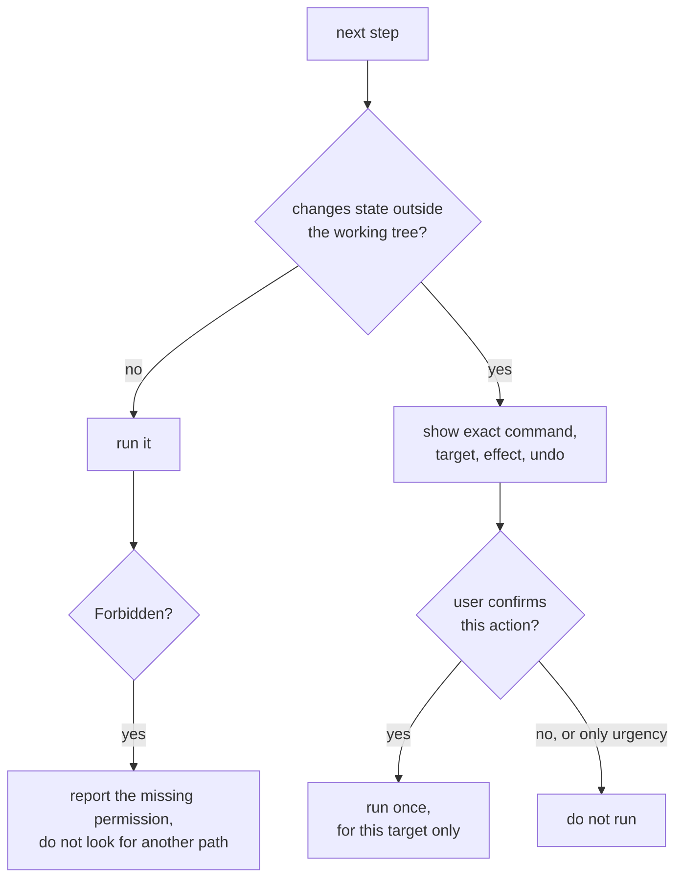
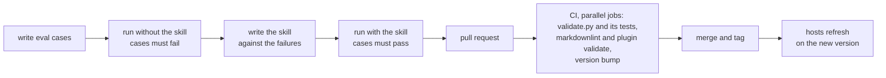

# Architecture

How the repository is built, how a request finds a skill, and what every skill has to obey. For installing and using the skills see the [README](../README.md), for the steps of a contribution see [CONTRIBUTING.md](../CONTRIBUTING.md).

## One source, many agents



Knowledge lives only in `SKILL.md` files that follow the [Agent Skills](https://agentskills.io/specification) standard. The manifests next to them carry a name, a version, and a description, nothing else. There are no copies and no build step. The manifest formats are specified by [Claude Code plugins](https://code.claude.com/docs/en/plugins-reference), [Claude Code marketplaces](https://code.claude.com/docs/en/plugin-marketplaces), [Codex plugins](https://developers.openai.com/codex/plugins/build), and [Agent Plugins 1.0](https://agent-plugins.org/schemas/1.0.0/plugin.schema.json).

```text
.
├── .claude-plugin/marketplace.json     # every plugin, plus role bundles
├── .agents/plugins/marketplace.json    # every plugin, for Codex
├── plugins/
│   └── krci/                           # one install unit
│       ├── .claude-plugin/plugin.json
│       ├── .codex-plugin/plugin.json
│       ├── plugin.json
│       ├── skills/
│       │   └── krci-<verb>-<object>/   # flat, one directory per skill
│       │       ├── SKILL.md            # frontmatter + body
│       │       ├── references/         # depth, loaded on demand
│       │       └── scripts/            # deterministic work only
│       ├── agents/                     # optional thin adapters
│       └── evals/<case>/               # prompt.md + graders/*.md
├── docs/
│   ├── architecture.md
│   └── skill-map.md                    # planned skills per stage and role
├── templates/
│   ├── SKILL.diagnostic.md             # read state, classify, verdict
│   └── SKILL.procedure.md              # inputs, steps, output, checks
└── scripts/
    ├── validate.py
    └── test_validate.py
```

## Install units

A plugin is one install unit with one tool set and one safety posture. `krci` serves everyone who delivers software on KubeRocketCI, from the ticket to production: BA, PO, and PM, developers, QA engineers, and DevOps engineers. A plugin for the people who install and operate the platform itself joins later as `plugins/krci-operator/`, because its tools and its risk differ.

Roles are metadata, not directories and not plugins. One plugin for all delivery roles keeps the foundation skill in one place, keeps the router and link checks meaningful, and lets one conversation follow a change from story to code to test to deployment.

### Role bundles

Installing `krci` gives the agent every skill, so it can move through the lifecycle without the user picking skills. A team that wants fewer descriptions in context installs a role bundle instead. A bundle is an entry in `.claude-plugin/marketplace.json` that installs a subset of the same skill directories, without copies:

```json
{
  "name": "krci-qa",
  "source": "./",
  "strict": false,
  "version": "0.2.0",
  "description": "KubeRocketCI skills for QA engineers: quality gates, autotests, test environments.",
  "skills": [
    "./plugins/krci/skills/krci-overview",
    "./plugins/krci/skills/krci-<verb>-<object>"
  ]
}
```

- `source` is the marketplace root. With a plugin directory as the source, the entry conflicts with that directory's `plugin.json` and fails to load, even though `claude plugin validate` accepts it.
- The name starts with the plugin name, the version equals the plugin version, and the router `krci-overview` is always included.
- Bundles exist for Claude Code and hosts that read its marketplace. Other hosts install single skills with `npx skills add KubeRocketCI/skills --skill <name>`.
- A bundle is added when its role has skills of its own. `validate.py` checks every rule above.

### Context budget

Every installed, model-invoked skill keeps its name and description in the agent's context in every session. Bodies load only when a request matches.

- A task skill description is at most 400 characters, the router at most 1024. "Use when … Not for …" fits.
- `validate.py` prints the description characters per plugin. `claude plugin details <plugin>@kuberocketci-skills` shows the projected tokens.
- A long procedure that is only ever started on purpose sets `disable-model-invocation: true`. Its description then stays out of the context until the user types its name, and no other skill can start it.

## How a request finds a skill

Nobody invokes a skill. The host decides from the descriptions, and content loads in three steps:



`krci-overview` is the foundation and the router. It triggers on any KubeRocketCI request, settles what all skills share, and hands over to the task skill:



Adding a skill is adding a directory. Hosts scan `skills/*/SKILL.md`, so nothing has to be registered with the host:



Routing quality is decided by two things the contract fixes: one skill per user intent, split by verb and never by resource kind, and a description that says when to use the skill and which sibling takes the neighboring intent.

## Roles and stages

Every skill declares who it serves and where in the lifecycle it acts:

```yaml
metadata:
  access: read-only
  roles: qa, devops        # ba, po, pm, dev, qa, devops, or all
  stage: test              # plan, code, build, test, deploy, operate, or all
```

Skills stay flat under `skills/`, because hosts scan one level below it. The README groups its table by stage and lists the roles per row. [skill-map.md](skill-map.md) shows planned and available skills per stage and role, so a contributor sees where a new skill belongs before opening an issue.

## Boundary with claude-plugins

[KubeRocketCI/claude-plugins](https://github.com/KubeRocketCI/claude-plugins) and this repository serve the same people from two sides:

| Repository | Holds | Examples |
|---|---|---|
| claude-plugins | The craft of a role, independent of the platform, and the tools for building the platform itself. Claude Code agents and commands. | Writing a PRD or a story, a test plan, Gherkin scenarios. Portal and operator development. |
| skills | How KubeRocketCI expects the work to arrive, host-agnostic. | The ticket key a team puts into branches, the repository contract, how an autotest becomes a quality gate, how a custom pipeline or chart is wired, how a version moves between environments. |

No generic craft here, no platform facts there. An agent in claude-plugins points at a skill here for platform facts.

## Tool tiers

A skill states what it needs to know. The tiers decide where that comes from, and a skill still works when a lower tier is missing.



Skill bodies name actions and platform tools. They never name a host's own tools, so the same text works everywhere. A ticket tracker is reached through the agent's own integration, and the skill names the action, such as reading the ticket.

## Safety gate

An agent acts with the user's identity, and inside environment namespaces that identity can delete workloads and read secrets. The wording of the gate lives once, in `krci-overview`.



State outside the working tree is the cluster, the portal, a Git remote, and the ticket tracker. Editing files in the working tree is not state-changing: a skill that writes a pipeline, a chart, a test, or a story draft stays `read-only`, and the user reviews the files before they leave the machine. Pushing them, opening a pull request, or writing to a ticket is state-changing.

Two more rules complete the gate: secret values never appear in output, and workloads owned by Argo CD are recovered through the platform's deploy flow, not patched by hand.

## Skill contract

| Rule | Why | Checked by |
|---|---|---|
| Frontmatter has only the six Agent Skills fields, plus `disable-model-invocation` | Other keys break uploads to other hosts. `disable-model-invocation` is ignored where it is unknown | `validate.py` |
| `name` equals the directory and starts with `krci-` | Hosts that install skills without the plugin namespace put every skill into one folder. The prefix keeps names unique there and says KubeRocketCI before the description is read | `validate.py` |
| After the prefix, a task skill name reads `<verb>-<object>`, one skill per user intent; the router `krci-overview` is the exception | Skills split by intent, not by resource, keep their descriptions from overlapping | review |
| `description` says when to use the skill, at most 400 characters (router 1024), no procedure summary | It is the routing surface and stays in every session. A host that finds the steps there may skip the body | `validate.py`, review |
| `compatibility` names required tools, the krci version, and the platform version | The user learns what is missing before the skill fails | `validate.py` |
| `metadata.access` is `read-only` or `mutating`: `mutating` changes state outside the working tree | Makes the safety level visible and lintable | `validate.py`, review |
| `metadata.roles` and `metadata.stage` use the fixed values | Skills can be grouped, bundled, and found per role | `validate.py` |
| Read-only skills have no state-changing command in a fenced block or a script | The default cannot erode silently | `validate.py` |
| Mutating skills have a `Confirmation gate` section | Every change passes the gate above | `validate.py` |
| No fenced block or script prints secret values | Secrets stay in the cluster | `validate.py` |
| Task skills name `krci-overview` | A skill installed alone still tells the agent where vocabulary and the safety contract are | `validate.py` |
| Body at most 500 lines, `references/` one level deep, links stay inside the skill | The body loads in full, and installers copy one skill at a time | `validate.py` |
| Agents preload skills and hold no knowledge | Knowledge in an agent prompt reaches one host only | `validate.py` |
| The router and the README table mention every skill, every skill has an eval case named after it | No skill is unreachable, undocumented, or untested | `validate.py` |
| Bundles install from the marketplace root, include the router, and carry the plugin version | A bundle loads, and it refreshes with the plugin | `validate.py` |
| Commands, flags, fields, and labels were checked against the source or a real platform | A wrong fact in a skill is a bug | review |
| Diagnostic answers start with the ownership verdict, `Owner:` line first | The user learns whether to act or to escalate before reading the analysis | review, evals |
| Nothing specific to one installation | The skills serve every KubeRocketCI tenant | review |

`plugins/krci/skills/krci-overview` is the reference implementation.

## Quality pipeline



Evals use `claude plugin eval`, which runs every case with the plugin and against a no-plugin baseline. A case that passes without the skill tests nothing.

## Versions

Each plugin has one semantic version, equal in its three manifests and in its bundles. CI rejects a pull request that changes a plugin outside its `evals/` without raising it, because hosts refresh an installed plugin only when the version changes. Releases are Git tags, which `gh skill` resolves.
